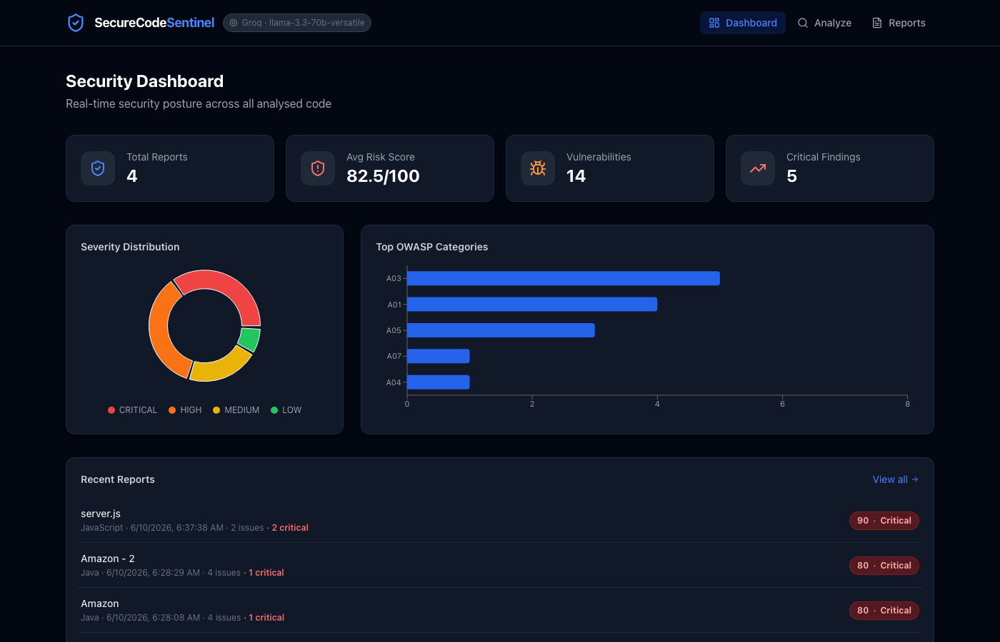
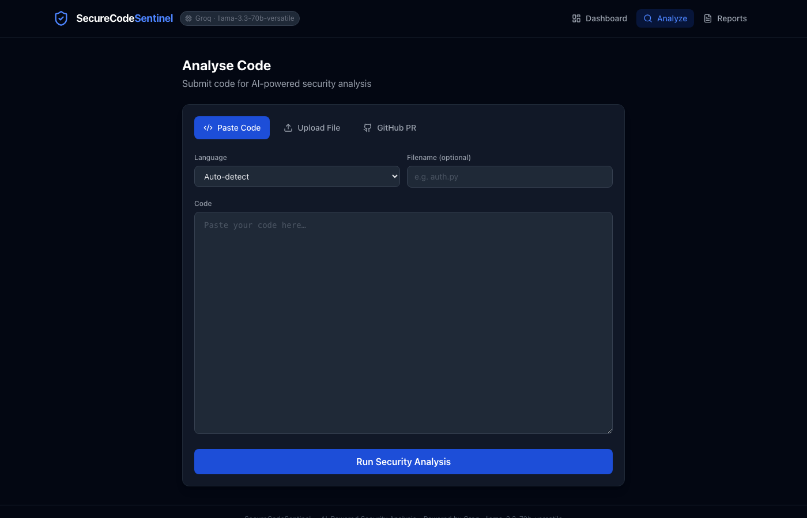
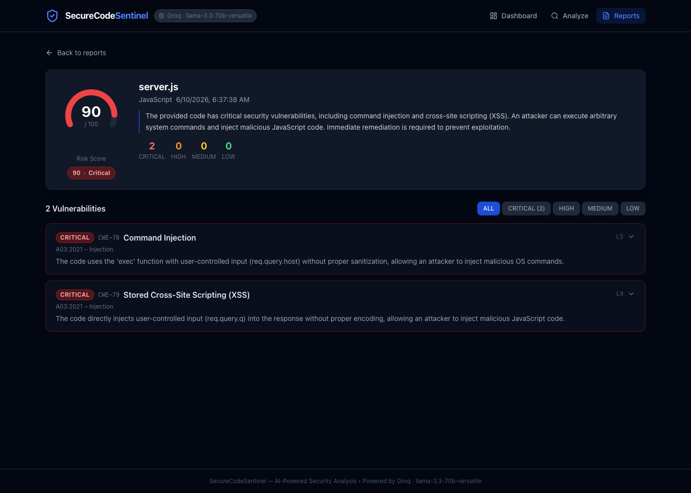

# SecureCodeSentinel

> AI-powered static analysis tool that detects security vulnerabilities in your code, maps them to OWASP Top 10 and CWE, and generates fix suggestions — all in a slick dark-mode dashboard.



---

## Features

- **OWASP Top 10 detection** — A01 through A10 (2021), with CWE IDs and severity ratings
- **Secrets & credential leakage** — hardcoded API keys, AWS credentials, tokens
- **Injection flaws** — SQL, command, XSS, path traversal, template injection, XXE
- **Fix-suggestion engine** — secure code replacements generated on demand per vulnerability
- **Risk scoring** — 0–100 score with CRITICAL / HIGH / MEDIUM / LOW breakdown
- **Three analysis inputs** — paste code, upload a file, or point at a GitHub PR URL
- **GitHub PR integration** — fetch diffs automatically and optionally post findings as a review comment
- **Multi-provider AI** — swap between Anthropic (Claude), xAI (Grok), or Groq with one env var
- **Persistent history** — all reports stored in SQLite; dashboard tracks posture over time

---

## Screenshots

### Security Dashboard
Real-time posture overview with severity distribution, top OWASP categories, risk trend, and recent reports.


### Analyze Page
Three-tab input: paste code, upload a file, or paste a GitHub PR URL.



### Report View
Per-file risk gauge, severity filter tabs, and expandable vulnerability cards with CWE mappings and AI-generated fixes.



---

## Tech Stack

| Layer     | Technology |
|-----------|-----------|
| Backend   | Python 3.11+ · FastAPI · SQLAlchemy (SQLite) |
| AI        | Anthropic SDK (Claude) · OpenAI SDK (Grok / Groq) |
| Frontend  | React 18 · Vite · Tailwind CSS · Recharts |
| Infra     | Docker · docker-compose · Nginx |

---

## Prerequisites

- **Python 3.11+**
- **Node.js 18+**
- An API key from one of:
  - [Groq](https://console.groq.com) — free tier, fast (recommended for trying it out)
  - [Anthropic](https://console.anthropic.com) — Claude models
  - [xAI](https://console.x.ai) — Grok models

---

## Quick Start

### 1. Clone & configure

```bash
git clone https://github.com/your-username/secure-code-sentinel
cd secure-code-sentinel
cp .env.example backend/.env
```

Edit `backend/.env` and fill in your provider and API key:

```env
# Choose one provider: anthropic | grok | groq
PROVIDER=groq
GROQ_API_KEY=gsk_...           # https://console.groq.com  (free)
# ANTHROPIC_API_KEY=sk-ant-... # https://console.anthropic.com
# XAI_API_KEY=xai-...          # https://console.x.ai

# Optional — only needed for GitHub PR analysis
# GITHUB_TOKEN=ghp_...

DATABASE_URL=sqlite:///./sentinel.db
CORS_ORIGINS=http://localhost:5173,http://localhost:3000
```

### 2. Run locally (without Docker)

```bash
# Backend
cd backend
python3 -m venv .venv && source .venv/bin/activate
pip install -r requirements.txt
uvicorn main:app --reload --port 8000
```

```bash
# Frontend (new terminal)
cd frontend
npm install
npm run dev
```

Open **http://localhost:5173**

API docs at **http://localhost:8000/docs**

### 3. Run with Docker

```bash
docker-compose up --build
```

- Frontend → http://localhost:3000
- Backend  → http://localhost:8000

> Make sure `backend/.env` is configured before running Docker.

---

## Provider Configuration

| Provider    | Env var             | Default model              | Notes                        |
|-------------|---------------------|----------------------------|------------------------------|
| `anthropic` | `ANTHROPIC_API_KEY` | `claude-opus-4-6`          | Prompt caching enabled       |
| `grok`      | `XAI_API_KEY`       | `grok-3`                   | OpenAI-compatible            |
| `groq`      | `GROQ_API_KEY`      | `llama-3.3-70b-versatile`  | OpenAI-compatible, free tier |

Override the model with `MODEL=<model-name>` in `.env`.

The active provider and model are shown in the header chip and footer of the UI, and returned by `GET /health`.

---

## GitHub PR Analysis

To analyse pull requests, add a GitHub personal access token to `backend/.env`:

```env
GITHUB_TOKEN=ghp_...
```

Generate one at **GitHub → Settings → Developer settings → Personal access tokens → Tokens (classic)** with `repo` scope (or `public_repo` for public repos only).

The GitHub token is optional — all other features work without it.

---

## API Reference

| Method   | Endpoint              | Description                              |
|----------|-----------------------|------------------------------------------|
| `GET`    | `/health`             | Provider, model, version                 |
| `POST`   | `/analyze`            | Analyse a code snippet                   |
| `POST`   | `/analyze/file`       | Analyse an uploaded file                 |
| `POST`   | `/analyze/github-pr`  | Analyse all changed files in a PR        |
| `POST`   | `/fix`                | Get detailed remediation for a finding   |
| `GET`    | `/reports`            | List all reports                         |
| `GET`    | `/reports/{id}`       | Get a single report                      |
| `DELETE` | `/reports/{id}`       | Delete a report                          |
| `GET`    | `/dashboard`          | Dashboard stats and chart data           |

Full interactive docs at **http://localhost:8000/docs**.

---

## Running Tests

```bash
cd backend
source .venv/bin/activate

# All unit + integration tests (no API key needed — fully mocked)
pytest

# Verbose output
pytest -v

# Real-API demo tests (requires a valid key in backend/.env)
pytest tests/test_demo.py -v -s
```

44 tests across:
- `test_models.py` — ORM + Pydantic schema validation
- `test_analyzer.py` — AI backend tests, parametrised for Anthropic and Grok providers
- `test_github.py`  — GitHub PR diff fetch and review comment formatting
- `test_api.py`     — Full endpoint integration tests (SQLite in-memory)
- `test_demo.py`    — End-to-end demo tests against the real API

---

## Project Structure

```
secure-code-sentinel/
├── .env.example                 # Copy to backend/.env and fill in your key
├── docker-compose.yml
├── screenshots/
├── backend/
│   ├── main.py                  # FastAPI app & all endpoints
│   ├── analyzer.py              # Multi-provider AI engine (Anthropic / Grok / Groq)
│   ├── github_integration.py    # PR diff fetch + review comment posting
│   ├── models.py                # SQLAlchemy ORM + Pydantic schemas
│   ├── database.py              # SQLite setup
│   ├── requirements.txt
│   └── tests/
│       ├── conftest.py          # Shared fixtures (in-memory DB, mocked AI)
│       ├── test_analyzer.py
│       ├── test_api.py
│       ├── test_github.py
│       ├── test_models.py
│       └── test_demo.py         # Real-API end-to-end demos
└── frontend/
    └── src/
        ├── App.jsx
        ├── api/client.js
        └── components/
            ├── Dashboard.jsx
            ├── AnalysisForm.jsx
            ├── ReportView.jsx
            ├── VulnerabilityCard.jsx
            ├── ReportsList.jsx
            └── RiskBadge.jsx
```

---

## Data Storage

Reports are stored in a local SQLite file at `backend/sentinel.db` (created automatically on first run). No external database required.

To inspect directly:

```bash
sqlite3 backend/sentinel.db \
  "SELECT filename, risk_score, language, created_at FROM reports ORDER BY created_at DESC LIMIT 10;"
```

---

## License

MIT
